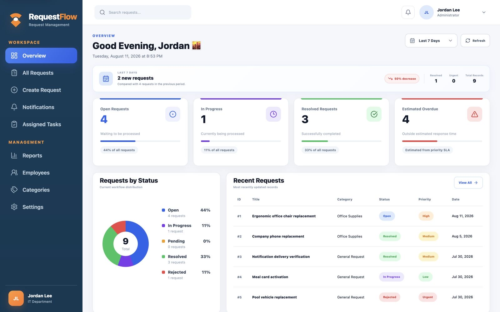
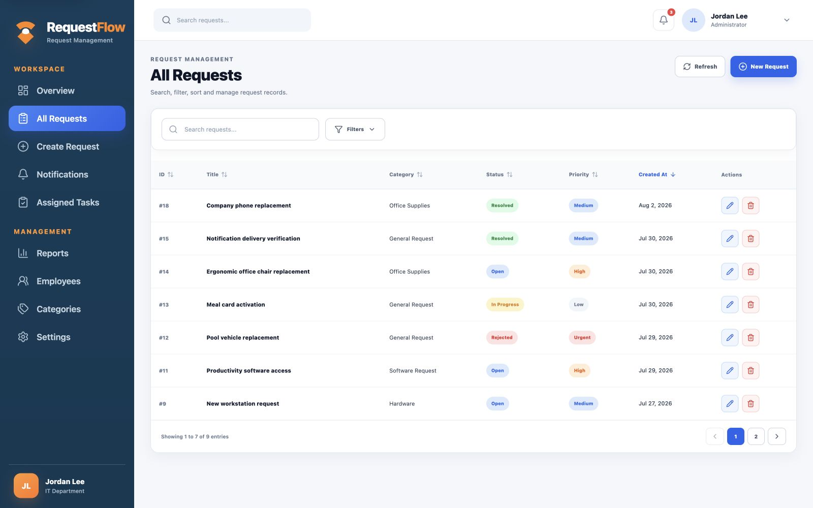
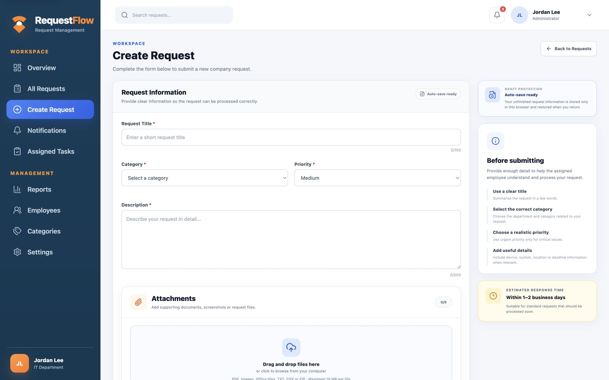
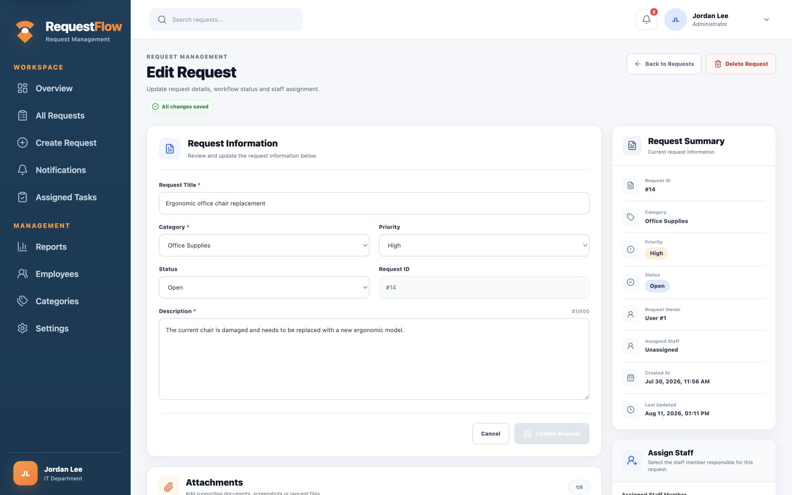
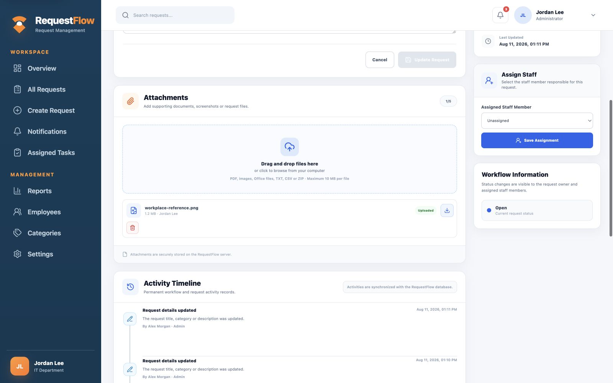
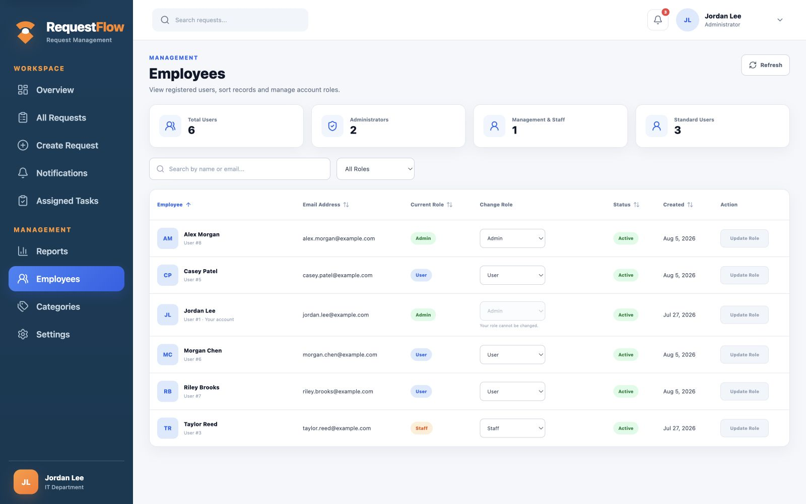
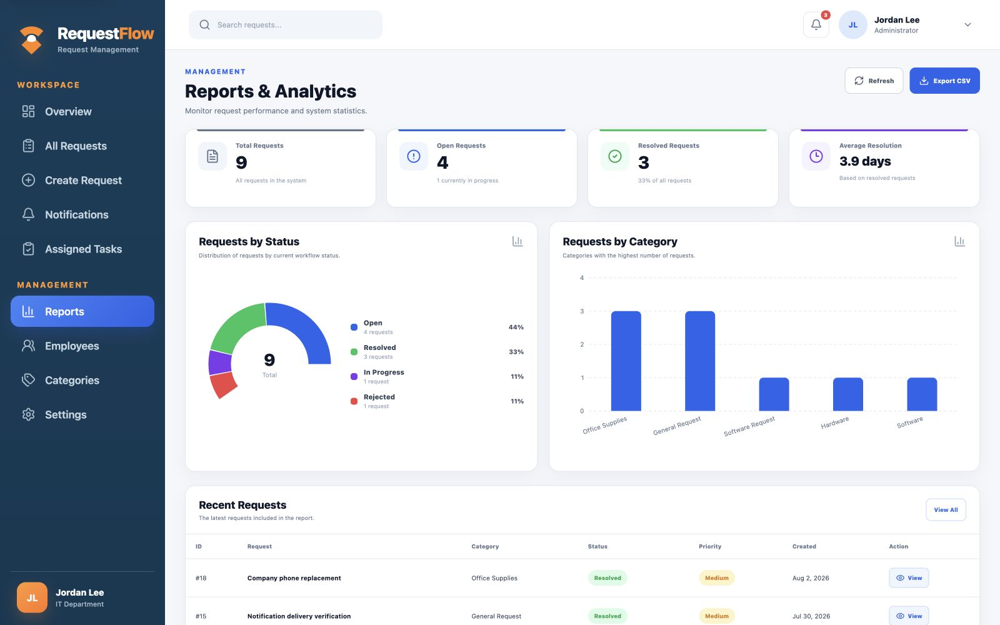
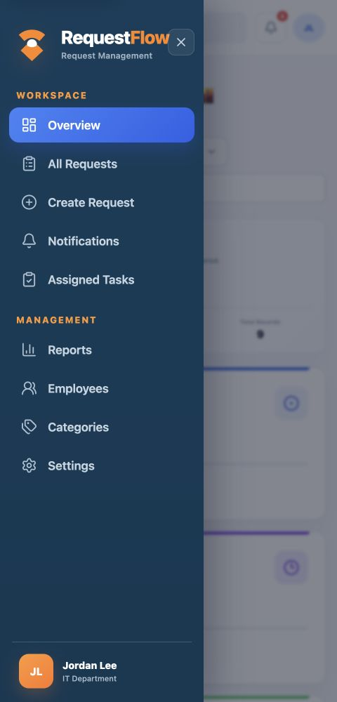

# RequestFlow

[](https://github.com/berkeyurtsever/RequestFlow/actions/workflows/ci.yml)

RequestFlow is a full-stack, role-based request management system developed during an internship. Employees can create requests, follow their progress, communicate through comments, upload attachments, and receive in-app notifications. Admin, Supervisor, Staff, and User roles have separate permissions and interfaces.

## Live Demo

[Open the live RequestFlow demo](https://requestflow-demo.onrender.com) and select **Explore Demo** to start a safe Supervisor session without creating an account.

> The free demo service may take 50 seconds or more to wake after inactivity. Demo data can reset after a deployment or restart. Registration, password changes, password reset email delivery, and uploads are disabled in the public demo.



## Features

- JWT-based authentication and role-based authorization
- Secure, expiring, single-use email password reset links
- Session invalidation after password changes and resets
- Request creation, editing, deletion, assignment, and status tracking
- Priority management, advanced filtering, sorting, and pagination
- Comments, attachments, permanent activity history, and notifications
- Employee, role, category, and system-setting management
- Dashboard charts, personnel workload, response/resolution time, and SLA metrics
- Per-user dashboard card customization saved across sessions
- Reports with CSV and PDF export
- Light and dark themes
- Responsive desktop, tablet, and mobile layouts
- Route-level loading so screens download only when opened
- Automated API integration and frontend route/layout tests
- Docker Compose development and production-like environment
- Loading, empty, error, confirmation, and toast states

## Screenshots

The gallery below was captured from the local Administrator interface in light mode using sample records and reflects the current application.

### Dashboard


### All Requests



### Create Request



### Edit Request and Autosave



### Attachments and Activity



### Employee Management



### Reports and Analytics



### Mobile Navigation

<p align="center">
  
</p>

The complete day-by-day development timeline remains available in [`docs/screenshots`](docs/screenshots).

## Technology Stack

### Backend

- C# and ASP.NET Core Web API
- Entity Framework Core
- SQLite
- JWT authentication
- Swagger / OpenAPI

### Frontend

- React and JavaScript
- Vite
- React Router
- Axios
- Recharts
- Lucide React
- CSS

## Requirements

- [.NET 10 SDK](https://dotnet.microsoft.com/download/dotnet/10.0)
- [Node.js 22.13 or newer](https://nodejs.org/)
- npm
- Git
- Optional: the `sqlite3` command-line tool for promoting the first local user to Admin
- Optional: Docker Desktop for the container setup

## Local Setup

### 1. Clone the repository

```bash
git clone https://github.com/berkeyurtsever/RequestFlow.git
cd RequestFlow
```

The repository is public and can be cloned without collaborator access.

### 2. Configure and start the backend

Use a local JWT key instead of committing a real secret:

```bash
cd backend/RequestFlow.Api
export Jwt__Key="replace-with-a-long-random-local-key"
dotnet restore
dotnet run --launch-profile http
```

The API applies Entity Framework migrations and creates the SQLite database automatically. Swagger is available at <http://localhost:5131/swagger> while the backend runs in the Development environment.

### 3. Create the first local user

Open Swagger and call `POST /api/Auth/register`, or run:

```bash
curl -X POST http://localhost:5131/api/Auth/register \
  -H "Content-Type: application/json" \
  -d '{
    "fullName": "Local Admin",
    "email": "admin@example.com",
    "password": "ChangeMe123!"
  }'
```

New registrations receive the `User` role. For local development, stop the backend and promote the first account with:

```bash
sqlite3 requestflow.db \
  "UPDATE Users SET Role = 'Admin' WHERE Email = 'admin@example.com';"
```

Restart the backend and sign in with that account. Change the example email and password for your own local environment. Never commit real credentials or the generated database.

### 4. Configure and start the frontend

In a second terminal:

```bash
cd backend/RequestFlow.Api/frontend/requestflow-ui
cp .env.example .env
npm ci
npm run dev
```

Open <http://localhost:5173>.

## Local Addresses

| Service | Address |
| --- | --- |
| Frontend | <http://localhost:5173> |
| API | <http://localhost:5131> |
| Swagger | <http://localhost:5131/swagger> |
| SQLite database | `backend/RequestFlow.Api/requestflow.db` |

## Docker Setup

Run the complete application with the API, frontend, persistent SQLite database, and persistent upload storage:

```bash
cp .env.docker.example .env.docker
# Replace JWT_KEY in .env.docker with a long random value.
docker compose --env-file .env.docker up --build
```

Open <http://localhost:5173>. See [DEPLOYMENT.md](DEPLOYMENT.md) before publishing a demo.

## User Roles

| Role | Main permissions |
| --- | --- |
| Admin | Manage all requests, assignments, users, roles, categories, reports, and settings |
| Supervisor | Review and assign requests, update statuses and priorities, and use management operations |
| Staff | Work on assigned requests and add comments or attachments |
| User | Create requests, view their own requests, and follow progress |

## Request Workflow

1. A user creates a request.
2. Management reviews the request.
3. The request is assigned to a Staff user.
4. Staff processes the request and updates its status.
5. Comments, attachments, notifications, and activity records are stored.
6. The request is resolved or rejected.

## Quality Checks

Run the same checks used by GitHub Actions before opening a pull request.

Backend:

```bash
dotnet test backend/RequestFlow.Api.Tests/RequestFlow.Api.Tests.csproj \
  --configuration Release
```

Frontend:

```bash
cd backend/RequestFlow.Api/frontend/requestflow-ui
npm ci
npm run lint
npm run test
npm run build
```

## Project Structure

```text
RequestFlow/
├── .github/
│   ├── ISSUE_TEMPLATE/
│   └── workflows/
├── backend/
│   ├── RequestFlow.Api.Tests/
│   └── RequestFlow.Api/
│       ├── Controllers/
│       ├── Data/
│       ├── DTOs/
│       ├── Migrations/
│       ├── Models/
│       ├── frontend/requestflow-ui/
│       ├── Program.cs
│       └── RequestFlow.Api.csproj
├── docs/screenshots/
├── DEPLOYMENT.md
├── SECURITY.md
├── docker-compose.yml
├── CONTRIBUTING.md
└── README.md
```

## Development Workflow

Use a short-lived branch for each change, such as `feature/docker-support` or `fix/mobile-navigation`, then open a pull request into `main`. See [CONTRIBUTING.md](CONTRIBUTING.md) for the complete workflow.

## Security Notes

- Do not commit `.env` files, JWT keys, local databases, uploads, or real credentials.
- `appsettings.json` contains development placeholders only; override secrets locally with environment variables.
- Treat every example or historical development key as compromised and never reuse it.
- Uploaded files and SQLite working files are intentionally excluded by `.gitignore`.
- Password reset requests always return the same generic response to prevent account discovery.
- Outside demo mode, password reset emails are sent only when SMTP delivery is enabled with hosting secrets. See [DEPLOYMENT.md](DEPLOYMENT.md) for configuration details.

## License

This is a public portfolio and internship project. No open-source license has been granted, so public access does not grant permission to copy, modify, or redistribute the source code.
